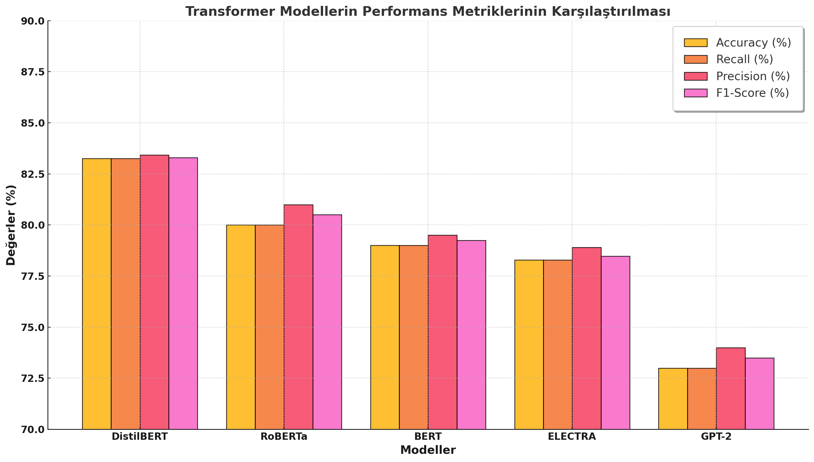

# Şiir Türlerinin Transformer Modelleri ile Sınıflandırılması

Bu proje, Türkçe şiirlerin belirli kategorilere sınıflandırılması amacıyla geliştirilmiş bir çalışmadır. Çalışma kapsamında, beş farklı Transformer tabanlı model (GPT-2, BERT, RoBERTa, ELECTRA, DistilBERT) kullanılarak sınıflandırma yapılmıştır.

## Proje Hakkında

**Proje Başlığı:** Şiir Türlerinin Transformatör Model Eğitimi ile Sınıflandırılması    

## Özellikler

- **Kategoriler:** Epik, Pastoral, Lirik, Satirik ve Felsefi şiirler.
- **Kullanılan Modeller:** 
  - GPT-2
  - BERT
  - RoBERTa
  - ELECTRA
  - DistilBERT
- **Platform:** Google Colab
- **Kütüphaneler:**
  - Huggingface Transformers
  - PyTorch
  - scikit-learn

## Veri Seti

- Türkçe şiirlerden oluşan veri seti kullanılmıştır.
- Veri temizleme, tokenizasyon ve veri setinin eğitim/test setlerine ayrılması işlemleri yapılmıştır.

## Performans Ölçütleri

Proje kapsamında modeller, aşağıdaki ölçütlerle değerlendirilmiştir:
- Doğruluk (Accuracy)
- Geri Çağırma (Recall)
- Kesinlik (Precision)
- F1-Skor
- ROC Eğrisi ve AUC Değerleri

## Sonuçlar

- **En İyi Performans:** DistilBERT, %83.25 doğruluk oranı ile en iyi sonuçları elde etmiştir.
- **Modellerin Genel Sıralaması:**
  1. DistilBERT
  2. RoBERTa
  3. BERT
  4. ELECTRA
  5. GPT-2

## Performans Metriklerinin Karşılaştırması

Aşağıdaki grafik, farklı Transformer modellerinin doğruluk, geri çağırma, kesinlik ve F1-Skor metriklerini karşılaştırmaktadır:

